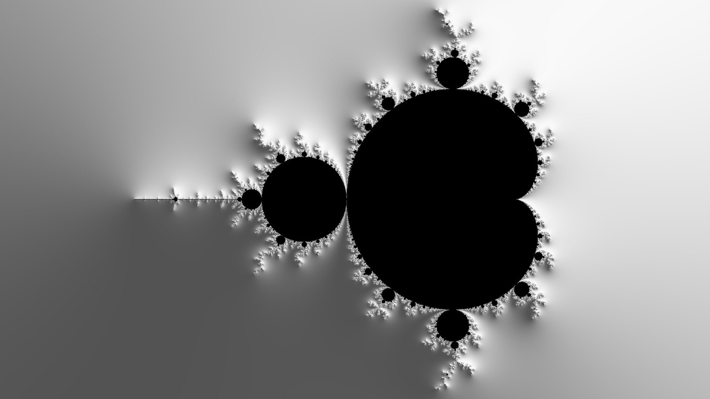

# Computing spatial images

DeepDrill supports the creation of spatial images. To create such an image, set the `enable` key in the `lighting` section to `yes:
```none
./deepdrill top.ini -o top.map -o top.jpg lighting.enable=yes
```
When spatial image creation is turned on, DeepDrill mixes the derived pixel color values with the depth information from a normal map. The result looks like this: 


Lighting can be controlled by two additonal keys, namely `lighting.alpha` and `lighting.beta`. The `alpha`  parameter specifies the direction of the incoming light on the xy plane. The `beta` parameter describes the inclination of the light source. Decreasing this angle increases the 3D effect and vice versa:
```none
./deepdrill top.map -o top.jpg lighting.enable=yes lighting.beta=10
```


```none
./deepdrill top.map -o top.jpg lighting.enable=yes lighting.beta=60
```


In addition, DeepDrill offers a special GPU shader called `relief.ini`. This filter ignores the color information and converts the normal map directly into a grayscale image:
```none
./deepdrill top.map -o top.jpg lighting.enable=yes gpu.illuminator=relief.glsl
```

