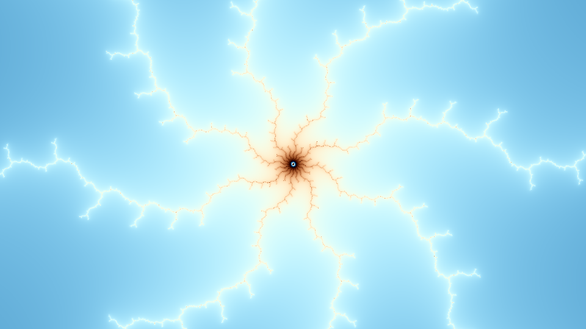

# Computing Still Images

In this tutorial, you will learn how to create the DeepDrill cover image using the DeepDrill tool chain. 

It is assumed that DeepDrill has been successfully installed on your computer. The structure we are going to create is buried deep in the Mandelbrot set. To compute the image, we need to tell DeepDrill the location of the object. This is done by passing a location file (`.loc`) as a command line parameter. A predefined location file for the cover image is stored in the `locations` directory under `spider.loc`. Before we continue, let's take a look at the contents of this file:
```
[location]

real = -2.2677664067387922388691356244792255191880358267082812585024439971401610105397724372362029456154053824622609164675371629196502594528331340581293956764916452361e-01
imag = -1.117239683936324591688558276484236515382167529582119984326546585480315896250189264406156057191817849297272681286515999107473779581849650803960450730872327827101e+00
zoom = 6.36119E152
depth = 3500000
```
Four key-value pairs are defined. The first two define the position of the center coordinate on the complex number plane. The third pair defines the magnification factor and the fourth pair defines the maximum number of iterations. If an orbit has not yet broken out at the time this iteration is performed, the corresponding point is considered part of the Mandelbrot set.

Assuming that the current directory is the DeepDrill build directory, we can start DeepDrill by executing the following command on the command line:
```bash
./deepdrill -o spider.map spider.loc
```
The following output is generated: 
````none
DeepDrill 1.1 - (C)opyright Dirk W. Hoffmann

Round 1: 518400 points

   Computing reference orbit: ................................. 0.01 sec
      Computing coefficients: ................................. 0.05 sec
       Checking probe points: ................................. 0.00 sec
      Computing delta orbits: ................................. 0.48 sec
             Saving map file: ................................. 0.01 sec

Total time: 0.57 sec
````
Note that we do not generate the image directly. Instead, we compute a so-called map file, which stores various information about the orbit of each pixel. The creation of the map file is the first phase of a two-step process. In the second phase, the map file is converted into an image. This phase is initiated by specifying a map file as input and an image file as output.
```bash
./deepdrill -o spider.png spider.map
```
The following output is generated: 
```none
DeepDrill 1.1 - (C)opyright Dirk W. Hoffmann

            Loading map file: ................................. 0.02 sec
                  Colorizing: ................................. 0.03 sec
           Saving image data: ................................. 0.06 sec

Total time: 0.12 sec
```
Besides png images, DeepDrill also supports bmp and jpg type images.

By default, DeepDrill creates a 960 x 540 image with a predefined color palette and other default settings. For our example, the result looks as follows:



All settings can be customized by specifying one or more profiles (`.prf` files). To customize the creation of our tutorial image, please create a file `spider.prf` with the following contents:
```
[image]
width = 1920
height = 1080

[palette]
colors = vulcano.png
```
This file instructs DeepDrill to create the output image in HD quality using a custom color palette. Profiles are passed to DeepDrill with the `-p` option:
```bash
./deepdrill -v -o spider.png -p spider.prf spider.loc
```
The image is now created in the following form: 


As can be seen in this example, it is possible to switch directly from a location file to an image. In this case the map file is only created internally and not written to disk. Since rendering the map file is by far the most time-consuming part, saving map files to disk is the preferred method if a single map file is to be rendered multiple times, e.g. with different color palettes. 

You may also have noticed the additional `-v` option. When this option is specified, DeepDrill runs in verbose mode and outputs details about the settings and the current calculation run.

